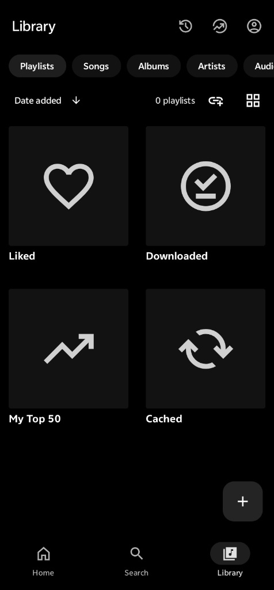
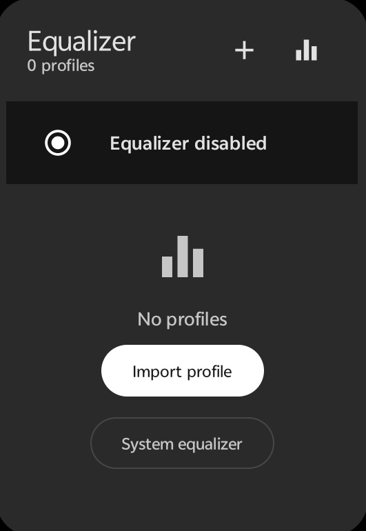

# 🤖 Muziso Android

<p align="center">
  
</p>

<p align="center">
  
</p>

<p align="center">
  
  
  <a href="https://github.com/xtros/Muziso/releases"></a>
  <a href="https://github.com/xtros/MuzisoAndroid/blob/main/LICENSE"></a>
</p>

<p align="center">
  <b>Muziso Android</b> is a high-performance native music player engineered for <b>Android 8.0 (Oreo) to Android 15</b>. Built with <b>Native Kotlin</b> and <b>Jetpack Media3 ExoPlayer</b>, Muziso delivers sub-30ms 320 kbps JioSaavn streaming, system-wide lockscreen playback controls, official Spotify 640x640 artwork resolution, local library playback, and 100% offline caching.
</p>

---

## 📚 Documentation & Guides

- 🏗️ **[Architecture Guide](docs/ARCHITECTURE.md)**: Deep dive into Android Audio Service, MediaSessionCompat, ExoPlayer, and Room SQLite database.
- ⚡ **[Installation & Sideload Guide](docs/INSTALLATION.md)**: Step-by-step APK sideloading instructions and Gradle compilation.
- 🤝 **[Contributing & Bug Hunter Program](docs/CONTRIBUTING.md)**: Android contribution standards and issue templates.
- 🔒 **[Privacy Policy](docs/PRIVACY.md)**: 100% offline-first privacy architecture, zero telemetry.
- ⚖️ **[Terms & Conditions](docs/TERMS.md)**: Open-source licensing terms and third-party media disclaimers.

---

## 🌟 Key Features (v0.1.8)

- 🚀 **JioSaavn Direct 320 kbps Streaming**: Sub-30ms instant CDN audio resolution (`song.getDetails&pids={id}`) for tracks, albums, search queries, and playlists.
- 🔔 **Background Playback & Lockscreen Controls**: Android `MediaSessionCompat` foreground audio service with persistent notification tray controls and WearOS / Android Auto support.
- 🎧 **Smart Audio Focus & Bluetooth**: Auto-pause on headphone disconnect / incoming calls; auto-resume on Bluetooth reconnect (`ACTION_AUDIO_BECOMING_NOISY`).
- 🔄 **Smart Version-Preserving Deduplication**: Automatically collapses identical song re-releases across compilation albums while preserving legitimate alternate versions & language dubs (`Remix`, `Unplugged`, `Acoustic`, `Lofi`, `Tamil`, `Telugu`, `Hindi`, `Malayalam`, `Kannada`).
- 🎨 **Official 640x640 Spotify Cover Resolver**: Automatic high-resolution album cover fetching across search results, discographies, and local music storage.
- 🎚️ **10-Band Graphic Equalizer**: 31Hz–16kHz frequency faders with live frequency curve and genre acoustic presets.
- 📥 **Offline Download & Local Caching**: Save streaming tracks locally for immediate offline playback with custom metadata and artwork indexing.
- 🔋 **Battery-Optimized Kotlin Engine**: Hardware audio decoding and low-power coroutine dispatchers for all-day listening.
- 🔒 **100% Local Privacy**: Zero telemetry, zero analytics scripts. All library data and playlists remain sandboxed on your device inside an encrypted Room SQLite database.

---

## 🖼️ Gallery

<table>
  <tr>
    <td align="center" colspan="2" width="100%">
      <b>🏠 Main Dashboard &amp; High-Res Music Explorer</b><br/>
      <sub>Trending charts, 320 kbps JioSaavn direct streaming &amp; instant search</sub><br/><br/>
      
    </td>
  </tr>
  <tr>
    <td align="center" width="50%">
      <b>🎧 Fullscreen Audio Player</b><br/>
      <sub>Ambient artwork blur &amp; 3D vinyl disc animation</sub><br/><br/>
      
    </td>
    <td align="center" width="50%">
      <b>📂 Your Library &amp; Custom Playlists</b><br/>
      <sub>Local music import, Liked Songs &amp; playlist management</sub><br/><br/>
      
    </td>
  </tr>
  <tr>
    <td align="center" width="50%">
      <b>🎚️ 10-Band Graphic Equalizer</b><br/>
      <sub>31Hz–16kHz faders, live frequency curve &amp; genre presets</sub><br/><br/>
      
    </td>
    <td align="center" width="50%">
      <b>👤 Account Profile &amp; Listening Statistics</b><br/>
      <sub>Avatar customization, member status &amp; playback stats</sub><br/><br/>
      
    </td>
  </tr>
</table>

---

## ⚡ Download & Installation

Visit the **[Muziso Releases Page](https://github.com/xtros/Muziso/releases)** to download the latest Android APK (`v0.1.8`):

### 📱 Android Packages
| Package Format | Target Architecture | Direct Download |
| :--- | :--- | :--- |
| **Android APK** (Direct Sideload) | Universal (ARM64, ARMv7, x86_64) | [Download Muziso_v0.1.8.apk](https://github.com/xtros/Muziso/releases/latest/download/Muziso_v0.1.8.apk) |
| **Google Play Store** | Play Store Release | [Muziso on Google Play](https://github.com/xtros/Muziso/releases) |

### 📱 How to Sideload APK:
1. Download `Muziso_v0.1.8.apk` to your phone or tablet.
2. Tap the downloaded file. When prompted, go to **Settings** &rarr; toggle on **"Allow from this source"**.
3. Tap **Install** and launch Muziso!

---

## 🛠️ Android Technology Stack

- **Application Core**: Native Android (Kotlin), Coroutines, ViewModel, Flow
- **Audio Pipeline**: Jetpack Media3, ExoPlayer, MediaSessionCompat Foreground Service
- **Network & CDN**: OkHttp, Retrofit 320kbps Stream Decoder
- **Artwork Engine**: Spotify Official 640x640 Web API Resolver
- **Database**: Room SQLite Database (Encrypted DAOs)

---

## 🚀 Developer Build Instructions

```bash
# 1. Clone the repository
git clone https://github.com/xtros/MuzisoAndroid.git
cd MuzisoAndroid

# 2. Compile debug APK
./gradlew assembleDebug

# 3. Compile release APK
./gradlew assembleRelease
```

---

## 🎯 Bug Hunter Reward Program

Found a functional bug, stream error, or UI glitch in **Muziso Android**? Help improve the platform and get rewarded! See **[CONTRIBUTING.md](docs/CONTRIBUTING.md)** for issue templates and guidelines.

---

## 📜 License & Legal

- **Software License**: Distributed under the MIT License. See [`LICENSE`](https://github.com/xtros/MuzisoAndroid/blob/main/LICENSE) for details.
- **Privacy Policy**: See **[Privacy Policy](docs/PRIVACY.md)** for data handling details.
- **Terms & Conditions**: See **[Terms & Conditions](docs/TERMS.md)** for user agreements and media disclaimers.
